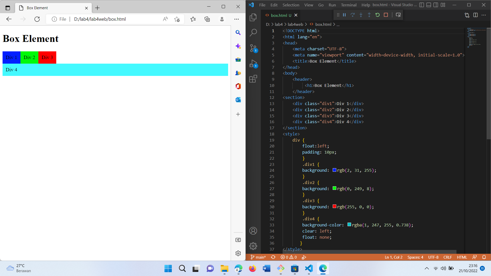
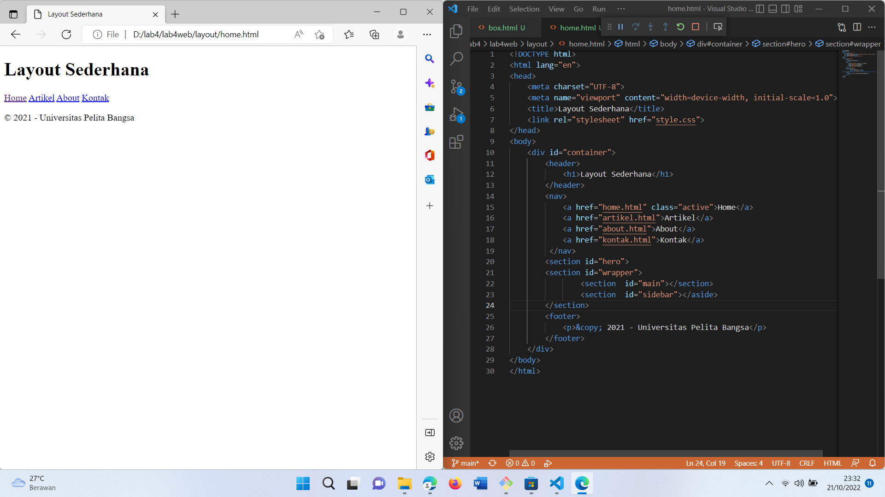
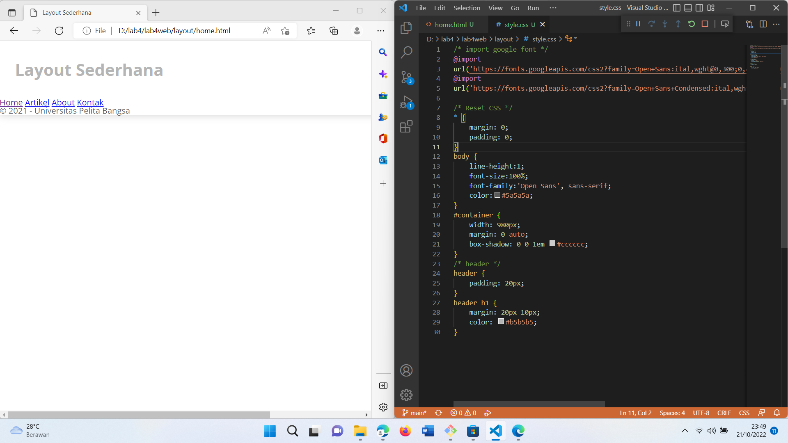
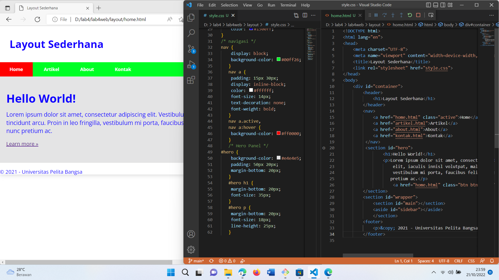
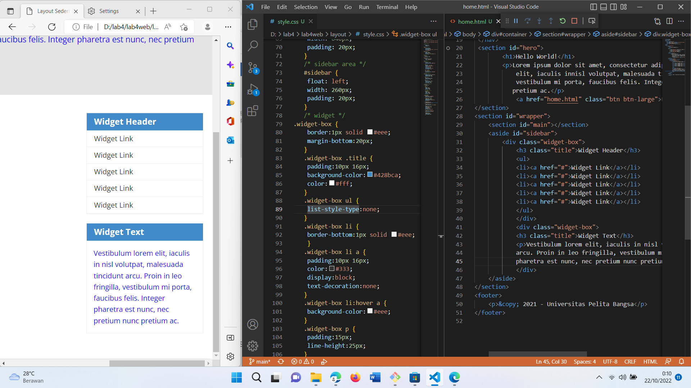
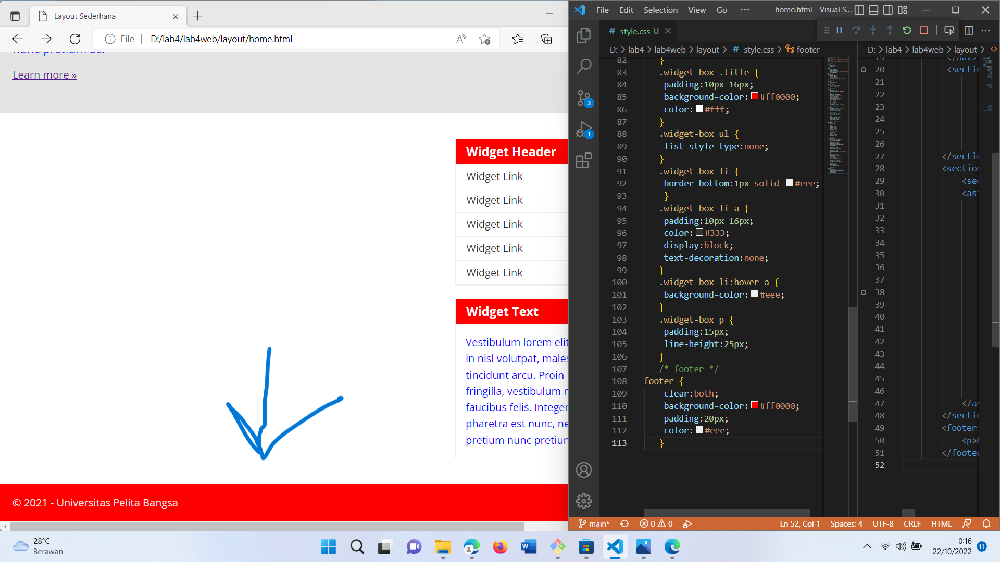
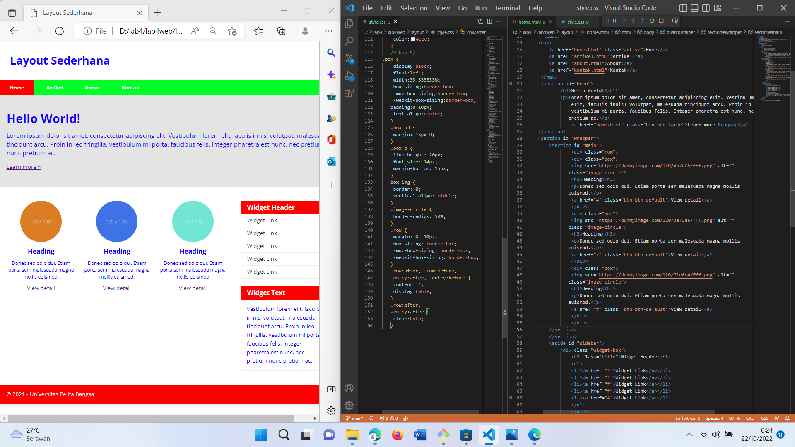
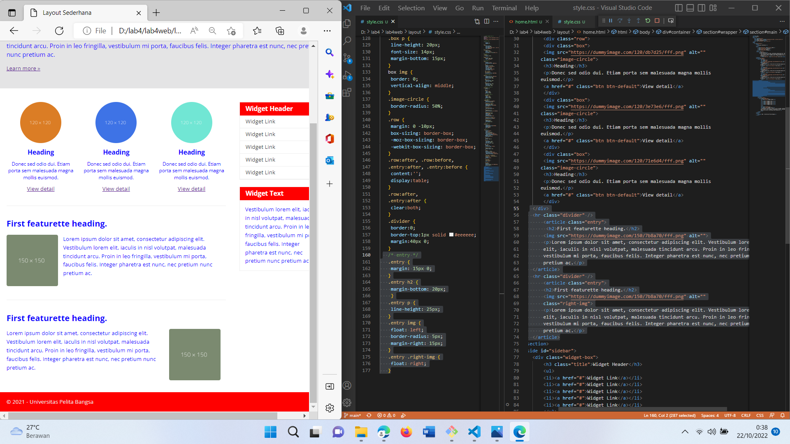
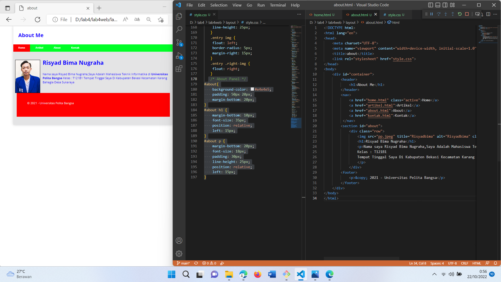
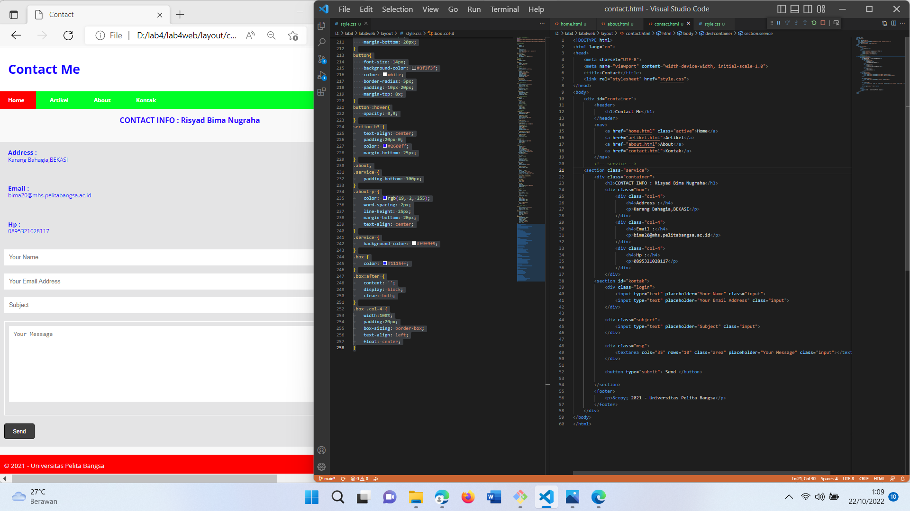

# LAB4WEB
PEMROGRAMAN WEB

TEKNIK INFORMATIKA

UNIVERSITAS PELITA BANGSA

NAMA  : RISYAD BIMA NUGRAHA

NIM   : 312110039

KELAS : TI.21.B1

DOSEN : Agung Nugroho,S.Kom.,M.Kom
# Langkah-langkah Praktikum
# Membuat Box Element

# Membuat Layout Sederhana

# Menambahkan CSS

# Membuat Navigasi Dan Membuat Hero Panel

# Membuat Sidebar Widget

# Mengatur Footer

# Menambahkan Element Pada Main Content Dan Menambahkan CSS

# Menambahkan Content Artikel

# Pertanyaan Dan Tugas
1.Tambahkan Layout untuk Menu About
=> Buat single layout yang berisi deskripsi,portfolio,dll
2.Tambahkan Layout untuk menu Contact
=> yang berisi form isian : nama,email,message,dll
# JAWABAN
# 1

# 2

